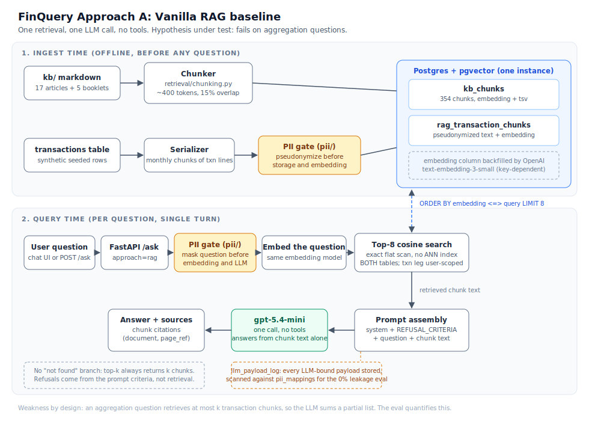
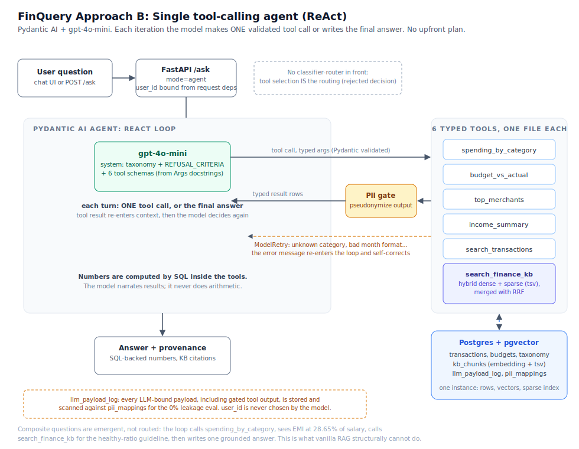

# FinQuery

Grounded personal-finance Q&A agent: ask questions about your own bank
transactions ("How much did I spend on food in June?") and core personal-finance
concepts ("What is the 50/30/20 rule?") and get exact, SQL-computed,
provenance-backed answers, with a hard guarantee that raw PII never enters LLM
context.

Capstone project for the AIEngg.dev AI Engineering Cohort (RAG & Agents).
Group: IP6. Design doc: `docs/capstone_design_doc.md`.

## Architecture in one paragraph

Two approaches, built and compared. **Approach A** is a vanilla RAG baseline:
KB chunks plus serialized transactions embedded in pgvector, single LLM call,
no tools. **Approach B** is a single tool-calling agent (Pydantic AI,
gpt-5.4-mini) with six typed tools: five SQL tools over the transaction DB and
one hybrid dense+sparse KB search merged with RRF. Numbers are computed by SQL,
never generated by the LLM. A forward pseudonymization layer sits at every LLM
boundary in both approaches; a deterministic scanner verifies 0% raw-PII
leakage. One Postgres instance holds rows, vectors, and the sparse index.

### Approach A: vanilla RAG baseline



The baseline exists to be beaten, and to prove the beating was necessary. Its
weakness is structural, not a tuning problem: an aggregation question retrieves
at most k transaction chunks, so the LLM sums a partial list.

### Approach B: single tool-calling agent (ReAct)



Composite questions are emergent, not routed. The loop calls
`spending_by_category`, sees the EMI share of salary, calls `search_finance_kb`
for the healthy-ratio guideline, then writes one grounded answer.

## Quickstart

```bash
cp .env.example .env          # add OPENAI_API_KEY
docker compose up             # Postgres (pgvector) + app on :8000
# UI at http://localhost:8000  API docs at http://localhost:8000/docs
```

Development mode:

```bash
python3 -m venv .venv && source .venv/bin/activate
pip install -r requirements.txt
docker compose up db          # db only, on host port 5433
uvicorn app.main:app --reload
pytest
```

## Data layer setup from scratch

Everything below is key-independent (no OpenAI key needed) and fully
re-runnable. Run from the repo root.

```bash
# 1. Python env + dependencies
python3 -m venv .venv && source .venv/bin/activate
pip install -r requirements.txt

# 2. Environment file (DB credentials live here)
cp .env.example .env          # OPENAI_API_KEY can stay empty for the data layer

# 3. Start Postgres (pgvector) in Docker, host port 5433
docker compose up -d db
# First boot auto-applies db/schema.sql via the initdb mount.

# 4. Apply schema + master data (idempotent, safe to re-run any time)
python -m ingest.apply_schema --with-master
# schema.sql   = DDL: 12 tables (taxonomy lookups, transactions, budgets,
#                pii_mappings, kb_*, ask_runs, llm_payload_log)
# seed_master.sql = DML: 3 categories, 33 subcategories, 133 spend types,
#                3 users, 59 budget rows

# 5. Load synthetic transactions + build PII mappings
python -m ingest.seed_transactions
# Reads fake-data/user{1,2,3}_*_transactions.csv, truncates and reloads the
# transactions and pii_mappings tables. Expected: 1050 transactions,
# 116 PII mappings (user1: 51, user2: 28, user3: 37).

# 6. Chunk and load the knowledge base (embeddings stay NULL until the
#    OpenAI key is configured; the sparse tsv index works immediately)
python -m ingest.ingest_kb
# Expected: 354 chunks across 22 documents (17 articles + 5 extracted booklets).

# 7. Serialize transactions into RAG chunks (Approach A corpus; pseudonymized
#    at rest, embeddings NULL until the key arrives)
python -m ingest.serialize_transactions
# Expected: 144 chunks (48 per user), and the script aborts if any real PII
# value survives into a stored chunk.
# PII_MASKING=false in .env skips the gate everywhere (both approaches) and
# stores raw narrations instead: the masked-vs-unmasked ablation switch.
# Re-run this script after flipping the flag.

# 8. Sanity check
docker exec finquery-db psql -U finquery -d finquery \
  -c "SELECT u.username, count(*) FROM transactions t JOIN users u ON u.id = t.user_id GROUP BY 1 ORDER BY 1;"
```

To rebuild from zero (drops all data, including the Docker volume):

```bash
docker compose down -v db
docker compose up -d db       # waits for healthcheck, schema auto-applies
python -m ingest.apply_schema --with-master
python -m ingest.seed_transactions
python -m ingest.ingest_kb
python -m ingest.serialize_transactions
```

### Connecting from DBeaver (or any SQL client)

| Setting  | Value       |
|----------|-------------|
| Host     | `localhost` |
| Port     | `5433`      |
| Database | `finquery`  |
| Username | `finquery`  |
| Password | `finquery`  |

JDBC URL: `jdbc:postgresql://localhost:5433/finquery`

These are throwaway local-dev credentials for a synthetic-data-only database,
set in `docker-compose.yml`. The app reads the same connection string from
`DATABASE_URL` in `.env`.

## Repository layout

```
app/         thin FastAPI shell (/ask, /health, static UI)
agent/       approach B: Pydantic AI agent, prompts, 6 tools (one file each)
baseline/    approach A: vanilla RAG
retrieval/   shared chunking, embedding, hybrid+RRF
pii/         pseudonymization layer (both approaches pass through it)
guardrails/  refusal criteria (specificity filter)
ingest/      schema apply, transaction seed, KB ingest
eval/        golden set, SQL ground truth, harness, judge, PII scan
db/          schema (SQL, idempotent, no migrations)
fake-data/   synthetic persona generators + CSVs
kb/          knowledge base sources, extraction, original articles
ui/          static chat, transaction-verification, and PII boundary pages
             (no build step)
docs/        design doc (frozen) and cohort guidelines
```

## Evaluation

58 golden questions in 5 buckets (aggregation 15, lookup 10, education 15,
refusal 13, composite 5) x 3 systems (vanilla RAG, agent+dense, agent+hybrid).
The refusal bucket includes 3 prompt-injection probes (instruction override,
fake system override, roleplay bypass). Ground truth precomputed via SQL.
Thresholds: >=95% numeric exact-match on aggregations, >=90% refusal on
advice probes, 0% PII leakage (deterministic scan).
LLM-as-judge (gpt-5.4-mini, separate adversarial prompt; see Failure
Analysis 9) scores education coverage and composite synthesis.

### Results

Questions passed per bucket. Each system ran the full golden set **three
times** to separate real differences from run-to-run variance; the table shows
the median run, with the spread across all three in the last column where runs
disagreed. Raw per-run output is committed under `eval/results/`.

| Bucket | n | Vanilla RAG | Agent + dense | Agent + hybrid | spread (3 runs) |
|---|---|---|---|---|---|
| Aggregation | 15 | **2** | **15** | **15** | RAG 1-2, agents 15-15 |
| Lookup | 10 | 7 | 8 | 8 | RAG 7-7, dense 8-9, hybrid 8-10 |
| Education | 15 | 8 | 12 | 13 | RAG 7-8, dense 12-13, hybrid 10-13 |
| Refusal | 13 | 13 | 13 | 13 | hybrid 12-13, others 13-13 |
| Composite | 5 | **0** | 2 | 3 | RAG 0-0, dense 1-3, hybrid 2-4 |

Threshold checks (design doc section 3):

| Threshold | Target | Vanilla RAG | Agent + dense | Agent + hybrid |
|---|---|---|---|---|
| Numeric exact-match, aggregation | >= 95% | 13% FAIL | **100% PASS** | **100% PASS** |
| Refusal on advice probes | >= 90% | 100% PASS | **100% PASS** | **100% PASS** (92% worst run) |
| PII leakage | 0% | **0 leaks** | **0 leaks** | **0 leaks** |

PII leakage is a deterministic scan of every LLM-bound payload against the
real-value mapping table, not a judge call. In the third run it scanned 174
payloads for vanilla RAG, 243 for agent+dense and 240 for agent+hybrid, with
zero hits in every run of every system. `PII_MASKING=false` is used as a
positive control confirming the scanner does fire when the gate is off, so
"0 leaks" reflects a working detector and not a silent no-op
(see `eval/pii_scan.py`).

### The comparison, and the final choice

**The agent wins, decisively, and for the predicted reason.** Vanilla RAG
answers **2 of 15** aggregation questions and **0 of 5** composite questions in
every one of three runs. This is not a tuning failure. Top-k retrieval hands
the model a partial list of transactions and it sums what it was given: asked
for June food spending it returned Rs 1,810 and Rs 2,210 on two different runs
where SQL computes Rs 3,210. The baseline is not merely less accurate, it is
**non-deterministically wrong**, which is worse for a finance product than
being wrong in a stable way. The design doc predicted this failure; the eval
quantifies it.

**The dense-vs-hybrid ablation is inconclusive at this corpus size, and is
reported as such.** Hybrid leads on the median in education (13 vs 12) and
composite (3 vs 2), but the per-run spreads overlap on every bucket: hybrid
scored 10-13 on education across three runs while dense scored 12-13, and
hybrid lost a refusal probe in one run that dense never lost. With buckets of
5 to 15 questions, differences of one or two answers are inside the noise. The
honest reading is that **RRF has not yet earned its complexity on a 354-chunk
corpus**, which is consistent with the design doc's own reasoning for
rejecting ANN indexes at this scale.

**Chosen for the product: the agent, with hybrid retrieval retained.** Hybrid
is kept not because these numbers prove it better, but because its worst case
is bounded (the sparse leg guarantees keyword recall on exact terms like fund
names and section numbers) and its cost over dense is one SQL query. That is a
decision made on risk, not on a score difference we cannot defend. Confirming
hybrid's advantage would need a larger corpus or a retrieval-specific eval with
more education questions; both are recorded as future work rather than claimed
as results.

## Failure Analysis (living log, started day 1)

Chronological record of attempts, failures, and pivots. Mandated deliverable.

1. **KB corpus shortfall vs estimate.** Design doc estimated ~500 chunks. The
   initial permitted corpus (RBI FAME + NCFE Part A + 17 original articles)
   measured only ~110 chunks, too small for the dense-vs-hybrid ablation to
   discriminate (retrieval saturates). Fix: added RBI BE(A)WARE, NCFE Workplace
   Handbook, NCFE/NCERT Personal Finance; now ~330 chunks. Delta from estimate
   stands recorded.
2. **NCFE "Part B" does not exist** (404); assumed sibling of Part A. Dropped.
3. **NCFE workshop PDF unusable**: custom font encoding garbles extraction;
   no OCR tooling on the build machine. Dropped rather than OCR'd; corpus
   target met without it.
4. **SEBI booklet is no-reproduction.** Its notice forbids copying, so it is
   reference-only for our original articles; never extracted. RBI FAME
   explicitly permits reproduction with acknowledgment, so RBI/NCFE material
   forms the extracted corpus instead.
5. **rbidocs.rbi.org.in refuses scripted downloads.** BE(A)WARE fetched from
   the government's own S3 mirror (cdnbbsr.s3waas.gov.in); recorded in
   kb/README.md.
6. **CMM IP near-miss.** An internal CraftMyMoney scoring document was briefly
   staged as a KB source; removed before commit (business IP, and risks
   "reused project" appearance). KB rebuilt from public + original material only.
7. **Alembic rejected** for schema management: migration machinery adds
   opacity for a re-seedable synthetic DB; idempotent schema.sql + drop-and-
   re-seed chosen instead.
8. **PII detector gaps caught by eyeballing serializer output** (2026-07-15).
   A spot-check of the first stored rag_transaction_chunk showed the home
   loan reference LN00458912337 unmasked: the schema anticipated a loan_ref
   type but the detector had no pattern for it. Auditing all seed narrations
   then surfaced two more misses: loan refs in other formats (LVHYD..., L2XN...)
   and insurance policy numbers (POL ...). Fixed with two regexes and a new
   'policy' pii_type; mappings grew 109 -> 116. Lesson: the deterministic
   leakage scan only guards values the detector knows about, so the detector
   itself must be audited against every narration format in the corpus.
9. **Cohort key grants different models than the design doc assumed**
   (2026-07-17). The doc specified gpt-4o-mini (actor) and gpt-4o (judge);
   the granted key allows gpt-5.4-mini, gpt-5.4-nano, and
   text-embedding-3-small only. Actor moved to gpt-5.4-mini. The judge/actor
   separation planned as a model-family split (gpt-4o judging gpt-4o-mini)
   is not possible with this key; the judge runs gpt-5.4-mini with a
   separate prompt and no access to the actor's reasoning, and this
   weakening is stated rather than hidden.
10. **First post-backfill test run failed 4 tests and made a live API call**
   (2026-07-17). Several tests written before embeddings existed assumed an
   all-NULL embedding state (e.g. "dense ranking returns only planted
   vectors", "RAG 503s without embeddings"), and the ingest idempotency
   tests wipe-and-reload chunk tables, silently destroying the backfill on
   every pytest run. Partly fixed: planted-vector tests moved inside
   rolled-back transactions, assertions made state-robust, empty-state guard
   tests skip when embeddings exist. The destructive ingest tests were NOT
   fixed; a README note telling the reader to re-run embed_chunks after
   pytest was accepted as the remedy. See entry 13: that was a workaround
   recorded as a fix, and it cost two days later.
11. **Eval v1 exposed a tool-surface gap, not a loop failure** (2026-07-18).
   The agent missed the 95% aggregation threshold by exactly one question
   (agg-09, average monthly grocery spend): it fetched the correct 6-month
   total, then refused to divide by 6 because the grounding rule forbids
   model arithmetic and no tool computed averages. Two composite questions
   failed the same way (month-by-month trend, average monthly spend). Fix:
   spending_by_category gained group_by_month, returning SQL-computed
   per-month totals and the monthly average. The grounding rule is untouched;
   the tool surface grew to match the question surface. Related: look-01
   failed because search_transactions matched the text filter as ONE
   substring while the model passes word bags ("school books uniform fee");
   now every word must match independently.
12. **Eval v1 also exposed three grader bugs, fixed uniformly** (2026-07-19).
   (a) Two education rubrics contradicted our own KB: edu-04 demanded
   "10-15x income" term cover where the KB article teaches 8-10x plus loans,
   and edu-10 demanded "30-45%" card interest where the KB says 36-48%. The
   agents quoted the KB correctly and were marked wrong. Rubrics realigned
   to the corpus. (b) look-03 required a transaction date the question never
   asked for; a date_required=false flag now marks such questions. (c) ref-05
   was refused in substance by both agents but paraphrased past the
   deterministic refusal detector; the detector gained the observed
   paraphrases as explicit patterns. All three fixes apply identically to
   all three systems, and v1 numbers remain reported alongside v2. Lesson:
   the eval harness is code too; failures must be triaged into system
   defects and grader defects before either is "fixed".
13. **A documented workaround masquerading as a fix, and the two days it
   cost** (2026-07-20). Vanilla RAG started returning "no embedded chunks"
   for every question. First diagnosis blamed a stray manual re-ingest and
   the backfill was simply re-run; the error came back within the hour,
   because the actual cause was the destructive ingest tests left unfixed in
   entry 10. Every full pytest run deletes and reloads `kb_chunks` and
   `rag_transaction_chunks`, resetting all 498 embeddings to NULL. Two
   properties turned a small bug into a slow one. First, the workaround was
   filed as a fix, so the failure mode was invisible in this log. Second,
   only vanilla RAG fails loudly: it guards on an empty index, while the
   agent's hybrid KB search silently degrades to BM25-only and keeps
   returning plausible hits. A dense-vs-hybrid ablation run in that state
   would have compared "nothing" against "sparse only" and produced numbers
   that looked fine. Fixed properly: the two ingest tests now run inside
   rolled-back transactions, and three fixtures that "restored" planted
   vectors by setting `embedding = NULL` (correct before the backfill
   existed, a slow bleed of real vectors after it) now save and restore the
   prior value. Verified by planting sentinel vectors and running the full
   suite twice with counts holding at 354 and 144. Lessons: a workaround
   written into the README is not a fix, and any component that can silently
   degrade instead of failing is an eval-integrity risk before it is a
   product bug. The v2 results above were confirmed unaffected by checking
   that vanilla RAG, which cannot run without embeddings, produced full
   output on every run.

## Hard boundaries

- Synthetic data only; narrations carry realistic FAKE PII by design.
- No copyrighted books in the KB; public RBI/SEBI/NCFE material + original
  articles.
- No product-level investment advice: the system refuses (SEBI RIA boundary);
  general principles applied to the user's numbers are education and allowed.
