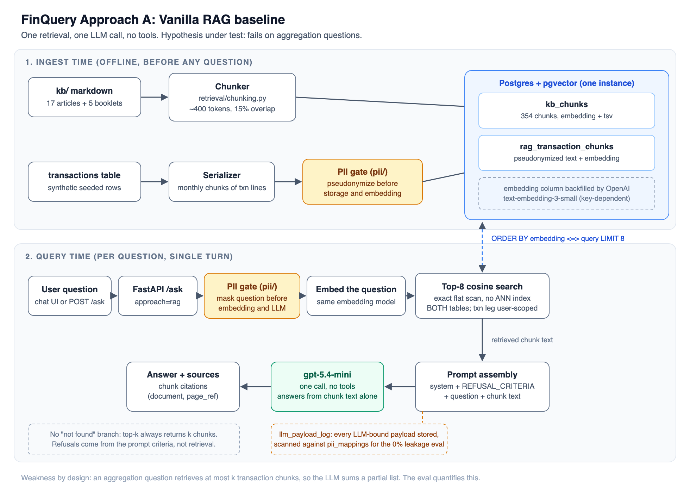
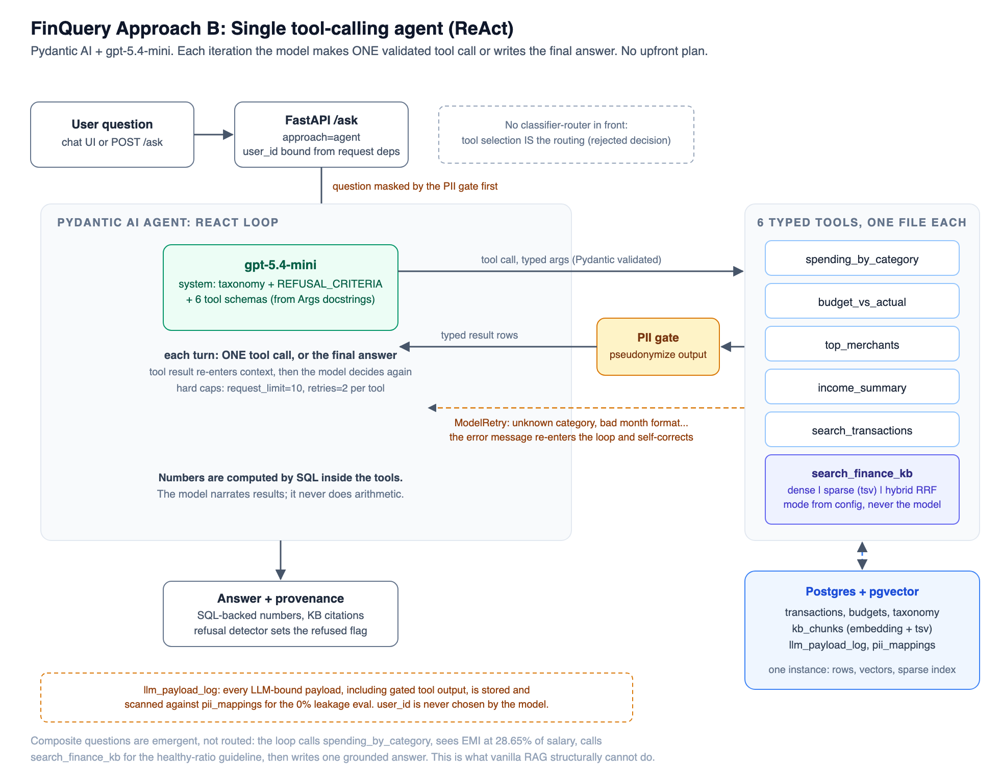

# FinQuery: Project Documentation

**AI Engineering Cohort (RAG & Agents), Capstone** | Group IP6 | Author: KrantiKumar Gajula

This document is self-contained: it assumes no prior reading of the design doc or
the repository README. It covers the problem, the data pipeline, the retrieval and
orchestration design, the evaluation and its results, the reasoning behind each major
decision, and the known limitations.

---

## 1. Problem

People who want to understand their own spending, or learn a personal-finance concept,
have two bad options today. They can paste raw bank statements into a general chatbot,
which exposes names, account numbers, phone numbers and UPI IDs to a third party and
still produces unreliable arithmetic over hundreds of rows. Or they can do the sums by
hand. FinQuery is a narrow Q&A system that answers two specific classes of question with
exact, provenance-backed figures, while guaranteeing that raw personal data never reaches
the language model.

**In scope, two question types:**

1. **Transaction Q&A**, answered with exact figures computed from the user's database:
   "How much did I spend on Food & Drinks in June?", "Am I over budget on transport?"
   Every number carries provenance (amount, transaction count, date range).
2. **Personal-finance education**, answered from a curated India-focused knowledge base:
   "What is the 50/30/20 rule?", "How does the debt-to-income ratio work?"

**Explicitly out of scope, and refused:** specific investment advice ("should I buy this
fund?"), which is regulated in India under SEBI's Registered Investment Adviser rules.
The refusal boundary is **specificity, not topic**. Applying a general principle to the
user's own numbers ("is my EMI ratio healthy?") is education and is answered. Naming a
product to buy, sell or hold, or calling market timing, is refused. Also out of scope:
multi-turn memory, portfolio analysis, forecasting, and transaction categorization (data
arrives pre-categorized).

The problem is deliberately narrow because the cohort's most common failure mode is a
vague objective. "An assistant that helps with money" is not a project; "exact SQL-computed
answers to two question types with a 0% PII-leakage guarantee" is one, and every design
choice below follows from it.

---

## 2. Data

All data is synthetic and reproducible from a single `docker compose up`. A mentor can run
the system cold with no access to any real account.

- **Transactions:** 1,050 rows across 3 synthetic users (the demo user has ~6 months of
  realistic Indian activity), each carrying a category from a **fixed taxonomy** (3
  categories, 33 subcategories, 133 spend types) assigned at seed time. The taxonomy is
  included in the agent's system prompt so that natural phrasing ("eating out") maps to a
  valid tool argument (Food & Drinks). Budgets: 59 rows, seeded so that at least one
  category is genuinely over budget, giving the eval a real signal to find.
- **Realistic fake PII by design.** Transaction narrations are modelled on real bank
  strings and carry fake UPI VPAs, phone numbers, masked account and card fragments, loan
  references and insurance policy numbers. This is what gives the 0%-leakage metric
  something real to catch; a corpus with no PII would make the guarantee meaningless.
- **Knowledge base:** 354 chunks across 22 documents (17 original articles written for this
  project plus 5 extracted public booklets from RBI and NCFE/NCERT investor-education
  material). No copyrighted books, and the SEBI booklet, which carries a no-reproduction
  notice, informs original articles but is never extracted. Chunking is ~400 tokens with
  15% overlap, appropriate for short self-contained articles.

**Two ingestion paths feed pgvector.** KB markdown is chunked and embedded directly.
Transactions take the second path, and only for Approach A: each transaction becomes one
text line (date, type, amount, category path, narration), lines are grouped by calendar
month, and each month's lines are packed into ~400-token chunks. A month therefore spans
several chunks, not one: user1's 60 transactions per month pack into 8 chunks of roughly
7 transactions each, giving 48 chunks per user and 144 in total, stored in
`rag_transaction_chunks` with their `source_txn_ids` and embedding. Unlike the KB, this
corpus is chunked with **no overlap**: overlapping windows would repeat transactions
across chunks and inflate any total the baseline tries to compute. This path is also where
Approach A's PII masking happens: each chunk is pseudonymized **before** storage and
embedding, so no real value is ever written to the vector store. The serializer aborts if
any real mapped value survives into a stored chunk. Approach B never reads these chunks;
its tools query the `transactions` table directly in SQL.

---

## 3. Architecture

Two approaches are built and compared, as the cohort requires. The baseline is not a
throwaway; it exists to establish what a simple system achieves and to prove that the added
complexity of the agent is justified rather than assumed.

### Approach A: vanilla RAG baseline



Everything is a document. KB articles and serialized transaction rows are embedded into
pgvector. A question is embedded, the top 8 chunks by cosine distance are retrieved (the
transaction leg scoped to the asking user), and a single LLM call answers from that context
with no tools. **Hypothesis under test: this works for education questions and fails on
aggregation.** The arithmetic makes the reason concrete: one month of this user's
transactions occupies exactly 8 chunks, and k is 8. A question like "how much did I spend
on food in June" would need all 8 June chunks to win all 8 retrieval slots, beating every
KB chunk and every other month, and the LLM would then have to sum the right subset of
~60 lines by hand. Retrieval is competing for slots against a corpus it cannot exclude,
and even perfect retrieval leaves the arithmetic ungrounded. The system also has no "not
found" branch: retrieval always returns k chunks, so refusals come from the prompt
criteria, not from retrieval.

### Approach B: single tool-calling agent (ReAct)



One agent (Pydantic AI, gpt-5.4-mini) with six typed tools. Each turn the model makes exactly
one validated tool call or writes the final answer; the tool result re-enters context and the
model decides again. There is no upfront plan and no classifier-router in front: **tool
selection is the routing.** The six tools are five SQL tools over the transaction database
(`spending_by_category`, `budget_vs_actual`, `top_merchants`, `income_summary`,
`search_transactions`) and one hybrid KB search (`search_finance_kb`).

**Numbers are computed by SQL inside the tools; the model never does arithmetic.** This is the
core reliability property. The model narrates results and cites sources, but every figure comes
from a database query. Guardrails: an input filter refuses investment-advice requests before the
loop starts, tool arguments are validated by Pydantic (a bad category or month format triggers a
`ModelRetry` whose error message re-enters the loop and self-corrects), and hard caps bound the
loop (10 requests, 2 retries per tool).

**Composite questions are an emergent capability, not a feature.** Asked "After paying my EMIs I
can't save enough, what should I do?", the loop calls `spending_by_category` for the EMI total,
`income_summary` for salary, and `search_finance_kb` for the debt-to-income guideline, then
writes one grounded answer. This cross-surface reasoning is exactly what vanilla RAG structurally
cannot do, and it is the clearest justification for the agent.

---

## 4. PII pseudonymization layer

This is a core requirement applied to **both** approaches, not an add-on. Before any text crosses
into the model, a forward pseudonymization step replaces detected PII with consistent fake values
from a per-user mapping table (real to fake, stable across calls so the model sees consistent
identities without ever seeing a real value). Detection is regex (UPI VPAs, phone numbers, masked
card and account fragments, loan references, insurance policy numbers) plus a known-values list.
Free-text name recognition is documented as out of scope; prior art (Microsoft Presidio) is
acknowledged, not imported.

The two approaches mask at **different points**, and this is a genuine architectural distinction:
the agent masks tool output at call time, while the vanilla RAG corpus was pseudonymized once at
ingest time. Either way, no real value reaches the model.

**The guarantee is measured, not asserted.** Every LLM-bound payload (system prompt, question,
tool result, answer) is logged to a `llm_payload_log` table and scanned deterministically against
the real-value mapping table. The check is a substring scan, cross-user, with no judge involved,
so it cannot be fooled by a lenient grader. As a positive control, running with `PII_MASKING=false`
produces leaks, which confirms the scanner actually fires rather than passing trivially. A
transparency page in the UI renders every payload with its pseudonyms highlighted, so the guarantee
is inspectable, not just a number in a report. One honest limit is stated plainly: the scan proves
that no **mapped** value leaked; detector recall (whether every real value was found in the first
place) is a separate risk, mitigated by auditing the detector against every narration format in the
corpus.

---

## 5. Evaluation

**Golden set:** 58 questions in 5 buckets, ground truth precomputed by SQL against the seeded
database (never hand-typed): aggregation (15), lookup (10), education (15), refusal (13, including
3 prompt-injection probes), composite (5). **Comparison matrix:** three systems (vanilla RAG, agent
with dense-only retrieval, agent with hybrid retrieval) times the golden set, each run **three
times** to separate real differences from run-to-run variance.

Scoring combines deterministic checks (numeric exact-match, date mentions, a refusal detector, the
PII scan) with an LLM-as-judge (gpt-5.4-mini with a separate adversarial prompt) for education
coverage and composite synthesis, where no single ground-truth number exists.

### Results

Questions passed per bucket, median of three runs:

| Bucket | n | Vanilla RAG | Agent + dense | Agent + hybrid |
|---|---|---|---|---|
| Aggregation | 15 | **2** | **15** | **15** |
| Lookup | 10 | 7 | 8 | 8 |
| Education | 15 | 8 | 12 | 13 |
| Refusal | 13 | 13 | 13 | 13 |
| Composite | 5 | **0** | 2 | 3 |

Threshold checks:

| Threshold | Target | Vanilla RAG | Agent + dense | Agent + hybrid |
|---|---|---|---|---|
| Numeric exact-match, aggregation | >= 95% | 13% FAIL | **100% PASS** | **100% PASS** |
| Refusal on advice probes | >= 90% | 100% PASS | **100% PASS** | **100% PASS** |
| PII leakage | 0% | **0 leaks** | **0 leaks** | **0 leaks** |

### Reading the results

**The agent beats the baseline decisively, and for the predicted reason.** Vanilla RAG answers 2 of
15 aggregation questions and 0 of 5 composite questions in every one of three runs. This is not a
tuning gap. Asked for June food spending, the baseline returned Rs 1,810 on one run and Rs 2,210 on
another, where SQL computes Rs 3,210: top-k retrieval hands the model a different partial list each
time and it sums what it was given. The baseline is not just less accurate, it is
**non-deterministically wrong**, which for a finance product is worse than being wrong in a stable
way. The hypothesis in Section 3 is confirmed and quantified.

**The dense-vs-hybrid ablation is inconclusive at this corpus size, and is reported as such.** Hybrid
leads on the median in education (13 vs 12) and composite (3 vs 2), but the per-run spreads overlap on
every bucket: across three runs hybrid scored 10 to 13 on education while dense scored 12 to 13, and
hybrid lost a refusal probe in one run that dense never lost. On buckets of 5 to 15 questions, a
difference of one or two answers is inside the noise. Claiming hybrid as a measured winner would not
survive scrutiny, so it is not claimed.

---

## 6. Decisions and their reasoning

**Chosen: the agent, with hybrid retrieval retained.** The agent over RAG is settled by the results.
Hybrid over dense is **not** settled by the results, and is kept on a different basis: its worst case
is bounded (the sparse BM25 leg guarantees keyword recall on exact terms like fund names and section
numbers, which dense embeddings can miss), and its cost over dense is a single extra SQL query merged
by Reciprocal Rank Fusion. That is a decision made on risk, not on a score difference the eval cannot
defend.

**Framework: Pydantic AI.** The backend skill set is FastAPI plus Pydantic, so tools become typed,
validated schemas with no new idioms, and the ReAct loop stays thin and inspectable, which matters
because the loop is the thing being evaluated. **LangGraph was rejected**: its graph abstractions pay
off for multi-agent or branching workflows, which this project does not have, and here they would only
hide the loop. **smolagents was rejected**: a code-agent that writes and executes Python is the wrong
risk profile for a finance surface, and its strength duplicates what typed SQL tools already provide
deterministically.

**Datastore: Postgres + pgvector, one instance** for rows, dense vectors and the sparse full-text
index. This makes hybrid search a SQL query rather than a second system to operate, and it is
right-sized for a 354-chunk corpus. An exact/flat vector scan is used deliberately; ANN indexes
(HNSW/IVF) solve a scale problem this corpus does not have.

**No classifier-router in front of the agent.** Tool selection is the routing, and composite questions
prove a hard router would be harmful: a router that sent "I can't save after EMIs" to a single surface
would break exactly the cross-surface reasoning that justifies the agent.

**Other rejections, recorded:** Graph-RAG (no entity-graph structure; the structured side already
lives in a relational DB), multi-agent (no coordination problem), memory and map-reduce (single-turn,
no long documents), re-ranking and HyDE (deferred until an eval exposes a miss they would fix, to avoid
adding complexity before a baseline demands it).

---

## 7. Limitations, stated honestly

- **Composite is the weakest real result** (2 to 3 of 5 for the agents) and is also the capability
  used to justify the agent. The failures are synthesis and multi-step sequencing, not arithmetic; the
  numbers the agent does compute are correct. This is a real ceiling, not a rounding error, and is a
  primary target for future work (a re-ranking step or a composite-specific tool).
- **The dense-vs-hybrid question is unresolved** at 354 chunks. Confirming or refuting hybrid's
  advantage needs a larger corpus or a retrieval-specific eval weighted toward education questions.
- **Judge/actor separation is prompt-level, and was tested rather than assumed.** The granted key
  allows only the gpt-5.4 family, so the judge cannot come from a different family as originally
  planned; it runs with a separate adversarial prompt and no access to the actor's tools or reasoning.
  To check whether sharing a model inflates the verdicts, the full matrix was re-run with a genuinely
  different actor, **gpt-5.4-nano judged by gpt-5.4-mini**, and compared against the primary
  **gpt-5.4-mini judged by gpt-5.4-mini** results. Every bucket in every system landed within one
  question of the primary run (RAG 2/15 aggregation on both; agent + dense 15/15 on both; agent +
  hybrid 14/15 versus 15/15), and PII leakage stayed at zero throughout. If the judge preferred
  answers from its own model, the mini actor should have outscored the nano actor under that same
  judge. It did not, which is evidence against self-preference bias, though not proof of its absence:
  the cross-model configuration swaps in a **weaker** actor, not a stronger judge, and the nano matrix
  was run once against a three-run median. The result that remains beyond reach is a judge more
  capable than the system it grades.
- **Actor model size barely moves accuracy, which is a feature of the design.** The same nano
  comparison doubles as a capability ablation. Nano matched mini on aggregation because the agent's
  numbers come from SQL rather than from the model, and vanilla RAG scored 2 of 15 on **both** models,
  confirming that the baseline's failure is structural and not a model deficiency. Nano is not adopted
  as the default on this evidence: its single hybrid run fell to 14 of 15 aggregation, below the 95%
  threshold, and one run is not enough to promote it.
- **PII detection recall is bounded by the regex set.** The leakage guarantee is precise ("no mapped
  value leaked") and is not overstated into "no PII can possibly leak". Free-text names are out of scope.

The full chronological record of attempts, failures and pivots, including a case where a workaround was
mistakenly recorded as a fix and resurfaced two days later, is maintained in the repository README's
Failure Analysis section.

---

## 8. How to run

**Repository:** https://github.com/CraftMyMoney/finquery

```bash
git clone https://github.com/CraftMyMoney/finquery.git
cd finquery
docker compose up            # Postgres (pgvector) + app on :8000
```

Full setup instructions are in the repository README:

- **Quickstart:** https://github.com/CraftMyMoney/finquery#quickstart
- **Cold-start data pipeline** (schema, synthetic seed, KB ingest, transaction serialization,
  embedding backfill), with the expected row count at every step so a mismatch is caught immediately:
  https://github.com/CraftMyMoney/finquery#data-layer-setup-from-scratch
- **Evaluation** (how to run the harness and reproduce the tables above):
  https://github.com/CraftMyMoney/finquery#evaluation
- **Failure Analysis** (attempted approaches, failures and pivots):
  https://github.com/CraftMyMoney/finquery#failure-analysis

Everything is reproducible from scratch: the database is synthetic and seeded by committed scripts,
so no external data source or account is needed beyond an OpenAI API key in `.env`. The evaluation
harness and its committed per-run outputs, including the nano ablation, live under `eval/`.
